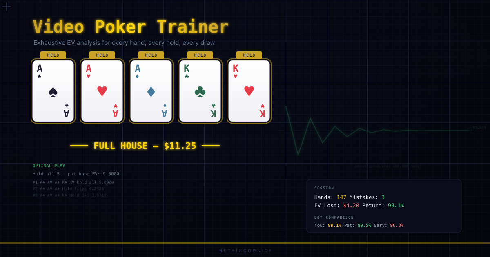
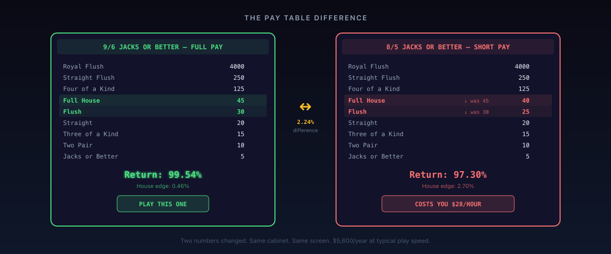
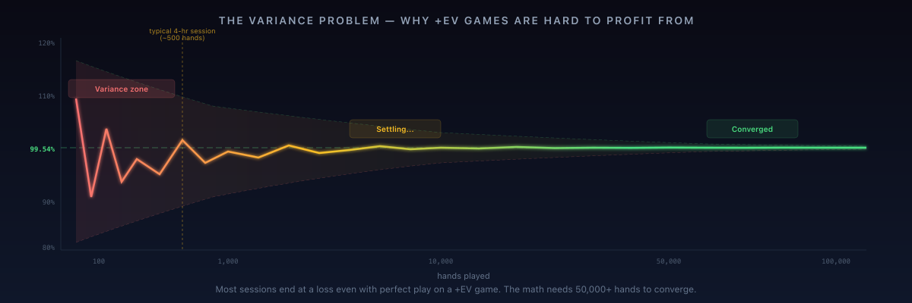

<p align="center">
  
</p>

# Video Poker Trainer

A mathematically rigorous video poker training simulator with exhaustive hand analysis, real-time optimal play guidance, and statistical validation. Not a casino game — a casino *education tool* that teaches players to identify profitable machines, make mathematically optimal hold/discard decisions, and understand exactly how much their mistakes cost them.

Part of the [Metaincognita Casino](https://holdem.metaincognita.com) simulator collection alongside the [No-Limit Hold'em Simulator](https://holdem.metaincognita.com) ([repo](https://github.com/cschweda/NLH-simulation)).

---

## The Brief, Fascinating Era of Professional Video Poker

### The Only Beatable Machine

From the early 1990s through the mid-2010s, a small, disciplined community of players made a genuine living playing video poker — primarily in Las Vegas, but also in Atlantic City, Mississippi, and the growing tribal casinos of the American West. They weren't gamblers in any meaningful sense. They were grinders: mathematicians, accountants, retired engineers, and self-taught strategists who recognized something that most casino visitors never notice.

Video poker is the only machine game in a casino where the player can have an edge.

Slot machines are programmed to return 85–95% over their lifetime — the player always loses, and the randomness is fully controlled by the machine's software. Table games like blackjack can theoretically be beaten through card counting, but casinos actively surveil and ban counters. Craps, roulette, baccarat — all have fixed negative expectation regardless of strategy.

But certain video poker machines, with specific pay tables, when played with mathematically perfect strategy, return more than 100% of the money put in. The game uses a standard 52-card deck with a cryptographic shuffle. The pay table is printed on the screen. The mathematics are completely transparent. There are no hidden house tricks, no adaptive algorithms, no "near miss" manipulation (which is actually illegal — the Illinois Gaming Board Technical Standards explicitly prohibit it in Section 2.3.1b). What you see is what you get: the same honest deck of cards you'd find in any home poker game.

### The Economics of a Razor-Thin Edge

The math was brutally thin. Full-pay Deuces Wild — the most favorable common variant — returns 100.76% with optimal play. That's a +0.76% player edge. Sounds good until you do the arithmetic:

- **$0.25 denomination × 5 coins = $1.25 per hand**
- **600–800 hands per hour** (600 for a careful player; 800+ for an experienced pro hitting buttons without hesitation)
- **$750–$1,000/hour in total throughput**
- **At 800 hands/hr: $1,000 × 0.76% = $7.60/hour from the mathematical edge alone**

Seven dollars and sixty cents an hour. Below minimum wage. For work that required absolute concentration, hours of daily practice, thousands of dollars at risk, and the social environment of sitting alone in front of a flickering screen in a casino that reeked of cigarette smoke.

Nobody would do this for $7.60/hour. The real income came from exploiting the casino's own incentive systems.

### Stacking the Comp Economy

Las Vegas casinos in the 1990s and 2000s ran aggressive player loyalty programs designed to keep slot players coming back. They awarded "comp points" based on **coin-in** — the total amount of money cycled through the machine, regardless of wins or losses. A player putting $1,000/hour through a video poker machine generated the same comp value as a slot player losing $100/hour, because the casino's tracking systems didn't differentiate between +EV and -EV play.

The professional VP players exploited this systematically:

- **Slot club cashback:** 0.25–1.0% of all coin-in returned as cash or free play. On $1,000/hour throughput, that's $2.50–$10.00/hour on top of the game edge.
- **Comp meals and hotel rooms:** Casinos rated players for "theoretical loss" (theo) — the amount the house expected to win from them based on their game choice, denomination, and hours played. Since the casino assumed video poker had a house edge, pros generated positive theo despite actually having an edge. A 4-hour session might earn a free buffet ($40 value) plus a comped room ($100+ value).
- **Mailer promotions:** Casinos sent monthly promotional offers to rated players — 2x, 3x, even 4x point multiplier days. On a 4x day, the cashback alone could reach $40/hour. Some casinos offered "$100 free play" coupons that, when combined with +EV machine selection, were pure profit.
- **Progressive jackpots:** Some machines had progressive meters that accumulated a small percentage of each bet into a growing jackpot. When the progressive climbed high enough, even normally -EV machines could become +EV. Pros tracked progressive meters across multiple casinos and swooped in when the numbers hit their calculated breakeven thresholds.
- **Loss rebate programs:** High-end casinos sometimes offered 10–20% rebates on net losses over a session. For a player with a small positive edge, a loss rebate was pure upside — if you won, you kept the winnings; if you lost, you got 10–20% back.

A disciplined pro stacking all of these could earn **$25–50/hour in total value** — the game edge, plus cashback, plus comps, plus promotions. Some reported $60–80/hour during peak promotional periods. This was a real living, though not a glamorous one.

### The People

**Bob Dancer** is probably the most well-known figure. A former computer programmer and tax attorney, Dancer applied rigorous analytical methods to video poker strategy and became its most prominent evangelist. His software *Video Poker for Winners* (later *WinPoker*) became the standard training tool — a desktop application that dealt hands, analyzed plays, and tracked mistake rates. His book *Million Dollar Video Poker* documented his high-stakes journey, but the real substance was always the math: the hand-rank tables, the EV calculations, the pay table analysis. Dancer notably played at higher denominations ($5 and $25 machines) than most pros, which amplified both the edge and the variance. He was also instrumental in popularizing the concept of "penalty cards" — situations where a discarded card reduces the probability of completing a straight or flush in the remaining deck, subtly shifting which hold pattern is optimal.

**Jean Scott**, who wrote under the name "The Frugal Gambler," approached VP from the comp optimization angle. Her books weren't really about gambling — they were about extracting maximum value from casino loyalty programs while playing a mathematically sound game. She documented how to get free hotel rooms, meals, and show tickets, and was particularly meticulous about tracking the total value of casino offers. Her readers weren't risk-seekers; they were retirees and bargain hunters who happened to have learned optimal Jacks or Better strategy. Scott's key insight was that even -EV video poker (like 8/5 JoB at 97.30%) could be +EV when combined with sufficient comp value — you didn't need a beatable game if the comps made up the difference.

**Skip Hughes** was one of the few pros who documented the daily reality of the lifestyle in detail. The picture he painted was not romantic: hours alone at a machine, the psychological weight of variance (long losing streaks are mathematically inevitable even with perfect play), the physical toll of sitting in a casino for 6–8 hours a day, and the constant low-grade anxiety that the casinos would tighten their pay tables — which they eventually did.

**Liam W. Daily** (pseudonym), who wrote *Video Poker, Optimum Play*, provided one of the most technically rigorous treatments of bankroll requirements and risk of ruin calculations. His work formalized what intuitive players knew: that the bankroll needed to survive variance was far larger than most aspiring pros assumed, and that "risk of ruin" — the probability of going broke before the math had time to work — was the actual threat, not the house edge.

There were hundreds of others whose names are less known — couples who structured their retirement around Las Vegas VP circuits, traveling from casino to casino to chase the best promotions; software engineers who wrote their own analysis tools; math professors who used VP as a living laboratory for probability theory. The community communicated through forums like *VideoPoker.com* and *vpFREE2* (a mailing list and later website that tracked full-pay machine locations across the country — an invaluable resource that functioned like a crowd-sourced scouting network).

<p align="center">
  
</p>

### What "Full Pay" Means

The term "full pay" refers to the most generous pay table commonly available for a given variant — the version that returns the highest percentage with optimal play. It's the baseline that defines the game's potential. Every other version of the same game with lower payouts is a "short pay" variant, and the difference between full pay and short pay is pure casino profit extracted from players who can't tell the machines apart.

The naming convention comes from the two numbers that most affect the return percentage — typically the Full House and Flush payouts:

| Variant | Full Pay | Return | Common Short Pay | Return | Difference |
|---------|----------|--------|-----------------|--------|------------|
| **Jacks or Better** | **9/6** (FH=9, Fl=6) | 99.54% | 8/5 | 97.30% | 2.24% |
| **Bonus Poker** | **8/5** (FH=8, Fl=5) | 99.17% | 7/5 | 98.01% | 1.16% |
| **Double Bonus** | **10/7** (FH=10, Fl=7) | 100.17% | 9/7 | 99.11% | 1.06% |
| **Double Double Bonus** | **9/6** (FH=9, Fl=6) | 98.98% | 8/5 | 96.79% | 2.19% |
| **Deuces Wild** | **25/15/9/5/3** (WR/5K/SF/4K/FH) | 100.76% | "Not So Ugly" 25/15/9/4/3 | 99.73% | 1.03% |

The numbers are small — 1–2% — but the dollar impact is enormous at professional play speeds. A 9/6 Jacks or Better machine and an 8/5 machine sit side by side on the casino floor. Same cabinet. Same screen layout. Same buttons. The *only* difference is that in one row of the pay table, the number 9 has been replaced with 8, and in another row, 6 with 5. That change costs the player $28/hour at $1,000/hour throughput. Over a year of regular play (4 hours/day, 5 days/week), that's **$29,120 in lost value** — from two numbers on a screen.

Deuces Wild uses a different naming convention because the Full House and Flush aren't the primary variables. Instead, pros identified Deuces Wild pay tables by five key payouts: Wild Royal (25), Five of a Kind (15), Straight Flush (9), Four of a Kind (5), Full House (3). Any reduction in any of these five numbers creates a short-pay variant. The full-pay version — sometimes called "Ugly Deuces" for its low Four of a Kind payout — is the only common VP game that returns over 100.5%.

The ability to instantly identify a full-pay machine by scanning the pay table was the foundational real-world skill of professional video poker. It's what separated pros from tourists, and it's what the Machine Scout training mode in this simulator teaches.

### What They Tracked

Professional VP players kept detailed records that would be familiar to any serious quantitative trader:

- **Bankroll requirements** — A $1.25/hand Deuces Wild player needed a minimum bankroll of **$6,000–8,000** to keep their risk of ruin below 5%, or **$10,000–15,000** for a more conservative 1% risk of ruin. (At $5/hand, multiply by 4.) The key driver: Royal Flushes and Four Deuces account for a disproportionate share of total return but hit infrequently — a Natural Royal once every ~40,000–45,000 hands (~50 hours), Four Deuces roughly once every 4,900 hands (~6 hours). Between these big hands, you're grinding at a net loss. Without adequate bankroll, a normal (and statistically expected) dry spell could wipe you out before the law of large numbers had time to work. Pros calculated their specific "risk of ruin" — the mathematical probability of going broke given their bankroll, game edge, and variance — and wouldn't play unless it was below their threshold.
- **Pay table scouting** — This was a critical real-world skill. Pros walked casino floors scanning the pay tables on every video poker machine. A 9/6 Jacks or Better machine sitting next to an 8/5 machine looks physically identical — same cabinet, same screen, same buttons. The only difference is two numbers in two rows of the pay table. That difference: 99.54% return vs 97.30%. At 800 hands/hour and $1.25/hand, playing the wrong machine costs **$28/hour**. Over a year of regular play, that's the difference between a living and a slow bleed. The "Machine Scout" mode in this simulator teaches exactly this skill.
- **Comp rate per property** — Pros maintained spreadsheets tracking their comp rate at every casino they played. Station Casinos might offer 0.5% cashback + generous food comps; Wynn might offer 0.25% cashback but comp premium hotel rooms; downtown properties might run aggressive 3x point promotions to compete with the Strip. Selecting the right casino on the right day was as important as selecting the right machine.
- **Theoretical loss ("theo")** — Casinos tracked each player's "theo" — what the house expected to win from them based on average play. This number determined comp levels. Since casinos assumed every player had negative expectation, a pro playing a +EV game generated positive theo while actually having an edge. This was the information asymmetry that made the whole enterprise work.
- **Mistake rate and error cost** — Using training software, pros tracked their error frequency and the cumulative EV cost of their mistakes. A 0.1% mistake rate on $1,000/hour throughput costs $1/hour — a significant fraction of the total edge. The best players aimed for zero mistakes per session. This simulator's per-hand mistake tracking and session-end comparison against Perfect Pat is modeled directly on this discipline.
- **Hours played and effective hourly rate** — Like any self-employment, the calculation included non-playing hours: travel to casinos, scouting machines, reviewing play, tracking promotions. A pro earning $40/hour at the machine who spent 2 hours daily on overhead was really earning $40 × 6 / 8 = $30/hour adjusted.

<p align="center">
  
</p>

### The Variance Problem

Even with perfect play and a positive mathematical edge, most video poker sessions end at a loss. This is not a contradiction — it's the central psychological challenge of professional VP.

The positive EV in Deuces Wild depends heavily on hitting rare, high-value hands. Four Deuces (200 coins) hits roughly once every 4,900 hands. A Natural Royal Flush (4,000 coins at max bet) hits once every ~40,000–45,000 hands. These hands account for a disproportionate share of the total return. In their absence, the game's return on the remaining hands is significantly below 100%.

A typical 4-hour session on full-pay Deuces Wild (about 3,200 hands at 800/hour) has roughly a **55–60% chance of ending at a loss**, even with perfect play. The median session result is slightly negative — you need to hit a Four Deuces or better to push a session positive, and that's a ~48% chance in 3,200 hands. Over a week of daily play, the probability of a net-positive week is around 60–65%. It's only over hundreds of hours — thousands of sessions — that the law of large numbers pulls the actual return toward the theoretical value. The convergence viewer in this simulator's analysis page demonstrates this vividly: at 100 hands, the return might be anywhere from 80% to 120%; at 10,000 hands, it's within a few percent; at 100,000 hands, it locks in.

Living with this variance required a specific temperament. Pros talked about "emotional bankroll" alongside financial bankroll. The math says you'll win in the long run, but the long run can be very, very long, and the short run can be brutal. Many aspiring pros washed out not because they couldn't learn the strategy, but because they couldn't tolerate weeks of losing while knowing they were playing perfectly.

### Why It Ended

The golden age of professional video poker died in stages.

**Phase 1: Pay table degradation (2000–2010).** Casinos gradually replaced full-pay machines with inferior variants. A casino floor that had twenty 9/6 Jacks or Better machines in 2000 might have two by 2008, buried in a corner, with the rest replaced by 8/5 and 7/5 versions. Full-pay Deuces Wild, once common on the Strip, migrated to off-Strip "locals" casinos (Station, Boyd, Coast properties) that catered to repeat Las Vegas residents. Even there, the inventory shrank year by year.

**Phase 2: Comp program restructuring (2008–2015).** This was the killing blow. Casinos shifted their loyalty programs from rewarding **coin-in** (total play volume) to rewarding **theoretical loss** (expected house profit). Under the old system, a VP pro cycling $1,000/hour through a +EV machine generated the same comp value as a slot player. Under the new system, the pro — whose theoretical loss was negative (i.e., a theoretical *win*) — generated minimal comp value. Cashback rates for video poker were slashed to 0.05–0.1%, often 5–10x lower than slot rates. Free rooms and meals dried up. Mailer promotions became targeted: heavy losers got generous offers, while break-even or winning players got nothing.

**Phase 3: Physical machine removal (2010–present).** As the few remaining full-pay machines aged out, casinos simply didn't replace them. A broken 9/6 JoB machine was replaced with a new multi-game terminal defaulting to 8/5 or worse. The IGT Game King machines that had been the workhorses of professional VP — with their reliable mechanics and familiar interface — were phased out in favor of server-based gaming platforms that made it trivial to adjust pay tables remotely.

**Phase 4: Regulatory tightening.** Some jurisdictions actively closed the loophole. The Illinois Video Gaming Act, for example, caps maximum theoretical return at 100% — meaning that +EV games like Deuces Wild and Double Bonus literally cannot be offered in Illinois VGTs. Nevada still allows them, but the casino's voluntary decision to remove them has the same practical effect.

**Where it stands today.** As of the mid-2020s, a handful of full-pay machines survive in a few downtown Las Vegas properties (the El Cortez is often cited) and scattered locals casinos. They are artifacts. The population of professional VP players has dwindled to a few dozen diehards, mostly retirees who play for the comp value and the intellectual stimulation rather than the income. The economic window — always narrow — has effectively closed.

### The Hidden Full-Pay Machines

Here's the thing that most people don't realize: full-pay machines almost certainly still exist in places where nobody is looking for them.

**Video poker machines outside of major casinos** — in bars, truck stops, convenience stores, laundromats, VFW halls, airports, and small-town gaming parlors — are often configured by a route operator (a company that owns and maintains the machines, splitting revenue with the location owner). The bar owner or store manager typically has no idea what pay table is loaded on the machine and wouldn't know a 9/6 from a 6/5 if they saw one. They signed a contract, the machine was installed, and they collect their share of the losses.

Route operators configure pay tables based on their own profit targets, and the machines they deploy are often older IGT Game King units — the same cabinets that once lived on casino floors with full-pay tables. When a machine is moved from a casino (which tightened its pay tables) to a bar in rural Nevada or a gas station in Montana, the pay table configuration might not be changed. The route operator might not even know what configuration is loaded. It's entirely possible — and documented on vpFREE2 — that full-pay 9/6 Jacks or Better machines sit in random bars and truck stops across Nevada, Montana, and other gaming states, untouched because nobody in the building knows enough about video poker to check.

**Illinois is a particularly interesting case.** The state legalized VGTs (Video Gaming Terminals) in bars and restaurants in 2009, creating a massive distributed gaming network — over 45,000 machines across the state by the mid-2020s. These machines are supplied by licensed terminal operators who configure the pay tables. The Illinois Gaming Board mandates a minimum 80% return and a maximum 100% return, but within that range, the operator chooses. Most operators set conservative tables (low 90s percent return) because the bar patrons don't know the difference. But there's no law preventing an operator from setting a 99.54% 9/6 JoB table — it's under the 100% cap. Whether any have done so, intentionally or accidentally, is an open question. The Illinois technical standards document (included in this repo's `/docs` folder) specifies the regulatory framework but says nothing about which specific pay tables operators must use.

**The vpFREE2 community** maintained crowd-sourced databases of full-pay machine locations for exactly this reason. Members would report sightings: "9/6 JoB at the Chevron on Highway 95 north of Tonopah" or "full-pay Deuces at Sam's Town Boulder." These reports were treated like birdwatcher sightings — rare, exciting, and worth driving hours to verify. The database was the connective tissue of the professional VP community, and its decline mirrors the decline of the machines it tracked.

**Could you still find one?** Yes. The probability is low, but it's not zero. The machines are physical objects that persist in the world. They don't automatically update their pay tables. An IGT Game King that was configured as 9/6 JoB in 2005 and placed in a bar in Elko, Nevada is still 9/6 today unless someone deliberately changed it. The bar owner doesn't know. The route operator may have forgotten. The regulators inspect for compliance (minimum payout, RNG integrity) but don't mandate specific pay table configurations above the minimum.

The practical problem is that these hypothetical full-pay machines in random locations offer minimal comp value (no slot club, no cashback, no mailer promotions) and low denominations (often nickel or quarter). The game edge alone — $7.60/hour at quarter Deuces Wild — isn't worth the drive to rural Nevada. But the *intellectual satisfaction* of scanning a pay table at a gas station and discovering a full-pay machine that nobody else has noticed? That's the treasure-hunt element that kept the vpFREE2 community alive long after the professional economics collapsed.

### State-by-State: Where Full-Pay Machines Could Still Hide

The regulatory landscape varies dramatically by state, and the gaps in oversight are where full-pay machines survive.

**Illinois** has one of the most interesting gaming ecosystems in the country. The state legalized VGTs (Video Gaming Terminals) in bars, restaurants, truck stops, and fraternal organizations in 2009, creating a massive distributed network — over 45,000 machines across the state by the mid-2020s. These machines are supplied by licensed terminal operators who configure the pay tables within regulatory bounds: the Illinois Gaming Board mandates a minimum 80% return and a maximum 100% return, but within that range, the operator chooses freely. Most operators set conservative tables (low 90s) because bar patrons don't know the difference. But there's nothing preventing an operator from loading a 99.54% 9/6 JoB — it's under the 100% cap. The Illinois technical standards (included in this repo's `/docs` folder) require every VGT to connect to a Central Communications System (CCS) that monitors operations in real-time (Section 2.11). In theory, the Gaming Board could see what pay table is active. In practice, they're monitoring for tampering, malfunctions, and revenue compliance — not checking whether a bar in Peoria is running 9/6 instead of 8/5. The sheer scale — 45,000+ machines across thousands of locations — makes individual pay table auditing impractical. An accidentally generous machine could run for years in a VFW hall or truck stop without anyone noticing, because nobody in the building knows enough about video poker to check, and the regulator is watching for fraud, not generosity.

**Iowa** doesn't have bar gaming like Nevada or Illinois — you won't find a VP machine at a random gas station in Ames. Gaming is confined to licensed casinos (including the racetrack-casino Prairie Meadows in Altoona), and the Iowa Racing and Gaming Commission regulates non-tribal operations with 80% minimum payout and central monitoring. The commercial casinos know what they're doing. But **Iowa's 12 tribal casinos** are the wild card. Tribal properties operate under individual gaming compacts with the state and are regulated by their own tribal gaming commissions, which vary significantly in size and sophistication. A large, well-managed operation like Meskwaki Casino (Tama) probably runs tight tables. But a smaller tribal property that purchased a batch of used Game Kings from a Las Vegas casino upgrading its floor might not have reconfigured every pay table. Tribal gaming commissions are often small teams wearing multiple hats — the VP machines are an afterthought compared to slot revenue. Some of these original 1990s-era machines could still be on floors with their original configuration. The most plausible Iowa scenario: scan every VP machine at the mid-tier tribal properties, especially in the low-traffic areas of the floor — the machines against the back wall, in the low-denomination section that nobody pays attention to.

**Michigan** has three distinct ecosystems. Detroit's three commercial casinos (MGM Grand, MotorCity, Hollywood) are sophisticated operations with full analytics teams — almost zero chance of accidental generosity. But Michigan's 12 tribal casinos, especially the smaller properties, present the same opportunity as Iowa's: used machines, smaller oversight teams, VP as an afterthought. The modern twist is Michigan's 2019 online gaming law. Several licensed platforms (BetMGM, FanDuel, DraftKings) offer online video poker with published, verifiable pay tables. Online operators compete for players and sometimes offer surprisingly generous returns because their overhead is lower (no physical machine, no floor space, no electricity). The irony: in Michigan, the most beatable VP machines might not be hidden in a truck stop — they might be on your phone.

**Nevada and Montana** remain the most promising states for hidden full-pay machines because they have the broadest bar/route gaming networks. In Nevada, the Gaming Control Board verifies machine integrity and the 75% minimum payout, but does not mandate specific pay tables above that floor. A route operator can load a 9/6 JoB or a 6/5 — both are legal, and nobody from the NGCB walks into a bar in Tonopah to check which one is running. Montana caps payouts at $800 per game cycle and requires initial state testing, but ongoing pay table oversight is minimal. Both states have thousands of machines in bars, convenience stores, and truck stops managed by route operators who configure tables based on profit targets and may not have audited every machine's settings in years.

**The regulatory gap that matters:** Every state regulates the machine's *integrity* (certified RNG, minimum payout, tamper detection) but no state actively monitors for *excessive generosity*. Regulators care that you're not being cheated below the legal minimum. They do not care if the machine is overly generous to the player. A full-pay Deuces Wild at 100.76% isn't a regulatory violation in Nevada — it's just a bad business decision by the operator. And if the operator doesn't realize they made it, nobody is going to tell them.

### What Remains

What remains is the mathematics. The hand rankings, the EV calculations, the strategy tables, the pay table analysis — all of it is as valid today as it was in 1995. The game hasn't changed; only the casino's willingness to offer beatable pay tables has changed.

This simulator preserves that mathematical heritage. When you see the brute-force EV analysis evaluate all 32 hold options for your dealt hand, you're seeing the same computation that Bob Dancer's software performed, that Stanford Wong described in *Professional Video Poker*, that Ethier formalized in *The Doctrine of Chances*. When the training panel tells you that holding the low pair beats holding the ace kicker by 0.047 EV, that number is exact — derived from exhaustive enumeration of every possible draw outcome, not from a heuristic or approximation.

The professional era may be over, but the math is eternal. And the math is genuinely beautiful: a game that looks like mindless button-pushing reveals, under analysis, a rich decision tree where seemingly insignificant choices — holding a 9 of clubs vs. discarding it — cascade through thousands of possible futures and shift the expected value by fractions of a cent that compound, over hours and days and months, into the difference between a winner and a loser.

---

## What Makes This Different

Most video poker trainers tell you what to hold. This one tells you **why**, shows you **every alternative**, and quantifies **the exact dollar cost** of your mistakes.

### Exhaustive EV Analysis

Every dealt hand is analyzed against all 32 possible hold combinations. For each combination, every possible draw outcome is enumerated (up to C(47,5) = 1,533,939 combinations) and classified. The resulting expected values are **mathematically exact** — not sampled, not estimated, not looked up from a table.

When you're dealt A♣-Q♦-J♣-T♣-9♣ in Jacks or Better, the trainer evaluates:
- Hold the four-card flush → EV: 1.2766
- Hold the three-card royal → EV: 1.2692
- Hold the four-card straight → EV: 0.8085
- ...and all 29 other options

This is the same brute-force approach described in Ethier's *The Doctrine of Chances* (Chapter 17) and used by professional video poker software.

### Real-Time Outcome Distribution

As you toggle holds, the training panel updates instantly with the exact probability of every possible outcome:

```
Draw Outcomes (holding 7♦ 7♣):
Three of a Kind    10.8%  ████████░░░
Two Pair           16.5%  ████████████░
Full House          2.1%  ██░░░░░░░░░
Four of a Kind      0.3%  ░░░░░░░░░░░
Nothing            58.4%  ██████████████████████████████
```

### Mistake Cost Tracking

Every suboptimal play is quantified in dollars:

> **MISTAKE** — Your play: Hold A♠ 7♦ 7♣ (EV: 0.824) → Optimal: Hold 7♦ 7♣ (EV: 0.871) → Cost: $0.06

Session totals accumulate: "47 hands played, 3 mistakes, $0.42 left on the table, effective return: 99.1%."

### Bot Persona Comparison

End a session and your dealt hands are replayed through four player archetypes:

| Persona | Strategy | Typical Return |
|---------|----------|---------------|
| **Perfect Pat** | Brute-force optimal | 99.5% |
| **Almost Alice** | Simplified strategy | 99.4% |
| **Gut-Feel Gary** | Common recreational mistakes | 96-97% |
| **Superstitious Sam** | Pattern-chasing (effectively random) | 94-95% |

The gap between you and Pat is the dollar value of your mistakes. The gap between Pat and Gary is the dollar value of learning strategy.

---

## Game Variants — Detailed Specifications

### Jacks or Better (5 pay tables)

The foundational game and the best starting point for learning. Standard 52-card deck, no wild cards. Minimum paying hand: pair of Jacks or better.

| Pay Table | Full House | Flush | Theoretical Return | Notes |
|-----------|-----------|-------|-------------------|-------|
| **9/6** | 9 | 6 | **99.54%** | Full-pay. The gold standard. Still found at some downtown Las Vegas properties. |
| 8/6 | 8 | 6 | 98.39% | Common on the Strip. Costs the player ~$14/hr vs 9/6. |
| 8/5 | 8 | 5 | 97.30% | Very common. Looks nearly identical to 9/6 — costs ~$28/hr. |
| 7/5 | 7 | 5 | 96.15% | Below average. Found in airports and tourist traps. |
| 6/5 | 6 | 5 | 95.00% | Worst common variant. Costs ~$57/hr vs 9/6. |

**Strategy complexity:** ~30 ranked entries. A simplified "simple strategy" with ~15 entries sacrifices only 0.08% return. The most learnable variant.

### Bonus Poker (8/5 full-pay)

Jacks or Better with enhanced four-of-a-kind payouts. Four Aces pays 80 coins (vs 25 in JoB), Four 2s–4s pays 40. Tradeoff: Full House drops to 8, Flush to 5.

- **Theoretical return:** 99.17%
- **House edge:** 0.83%
- **Key difference from JoB:** Aces are held more aggressively. Low pairs (2s–4s) gain value due to the 40-coin bonus. Strategy is very similar to JoB with subtle adjustments.
- **Real-world prevalence:** Extremely common. Often the most available variant on casino floors.

### Bonus Poker Deluxe (8/6)

Simplified bonus variant. All four-of-a-kind hands pay 80 coins regardless of rank — no differentiation between four Aces and four 5s. Two Pair pays only 1:1 (vs 2:1 standard), increasing volatility.

- **Theoretical return:** 98.49%
- **House edge:** 1.51%
- **Key difference:** Simpler strategy than Bonus Poker (no quad rank differentiation). Higher volatility from the Two Pair reduction. Good intermediate variant.

### Double Bonus (10/7 full-pay)

Massive four-of-a-kind bonuses: Four Aces pays 160 coins. The tradeoff: Two Pair pays only 1:1. **One of the rare player-advantage games.**

- **Theoretical return:** 100.17% **(player edge: +0.17%)**
- **Key difference:** Two Pair paying 1:1 changes everything. Break two pair more often. Aces held extremely aggressively. Most sessions end at a loss despite the positive theoretical edge — variance is brutal.
- **Real-world note:** These machines are specifically tracked by advantage players. Casinos have largely removed full-pay 10/7 from their floors. In Nevada, games above 100% return are legal; in Illinois, the Gaming Board caps return at 100%.
- **Why it's hard to profit:** The +0.17% edge at $1.25/hand = $1.70/hour from the math alone. You need Royal Flushes (accounting for ~2% of return) to stay positive, and those hit once every ~40,000 hands.

### Double Double Bonus (9/6)

The most complex non-wild variant. Adds kicker bonuses: Four Aces with a 2, 3, or 4 kicker pays **400 coins** — nearly as much as a Royal Flush. Extremely popular in Vegas because the big hits are spectacular.

- **Theoretical return:** 98.98%
- **House edge:** 1.02%
- **Key difference:** Kickers matter. A 2, 3, or 4 alongside three Aces must be held — unlike in any other variant. The 400-coin jackpot hand reshapes strategy around preserving potential kickers. Two Pair pays 1:1, maintaining high volatility.
- **Strategy complexity:** Highest of any non-wild variant due to kicker considerations. The full strategy table has 45+ entries.

### Deuces Wild (Full Pay)

All four 2s are wild cards. Minimum paying hand: Three of a Kind (pairs are too frequent with four wilds). **The highest-return common video poker game.**

- **Theoretical return:** 100.76% **(player edge: +0.76%)**
- **Key difference:** Completely different strategy organized by deuce count (0, 1, 2, 3, or 4 deuces dealt). New hand types: Four Deuces (200 coins), Wild Royal Flush (25), Five of a Kind (15). **Never discard a deuce.**
- **Strategy complexity:** ~45 entries across 5 sub-strategies. More complex than JoB but highly structured — each deuce count has its own ranked list.
- **Real-world note:** Full-pay Deuces Wild was the primary game of professional VP players. The +0.76% edge + comps made it the best available machine game from the 1990s through ~2012. Full-pay machines are now extremely rare.
- **Variance:** Extremely high. The positive EV depends on hitting rare big hands (Four Deuces at 200 coins, Natural Royals at 4000). Most realistic sessions (200–500 hands) end at a loss even with perfect play.

---

## Statistical Simulation

The `/analysis` page runs batch simulations across all variants with optimal play:

- Strategy lookup tables (published Wizard of Odds strategies) for fast execution
- Variant-specific strategies: JoB (~30 entries), Deuces Wild (5-branch by deuce count), DDB (kicker-aware)
- Web Worker execution — UI stays responsive during simulation
- Configurable: 500–10,000 hands per run, 1–5 runs per variant
- Per-variant metrics: theoretical vs actual return, deviation, range
- Downloadable reports
- Progress indicator visible across all pages

### Methodology

| Component | Precision |
|-----------|-----------|
| RNG | `crypto.getRandomValues` + Fisher-Yates shuffle |
| Hand classification | Deterministic, verified against standard rankings |
| In-game EV | Exhaustive enumeration — mathematically exact |
| Simulation strategy | Published strategy tables (<0.1% EV loss vs brute-force) |
| Pay table payouts | From Wizard of Odds published values |
| Theoretical returns | From Wizard of Odds published values |

The only approximation in simulation: penalty card adjustments are omitted from strategy tables, affecting ~2% of hands at ~0.01% EV each.

## Reference Sources

- **Ethier, S.N.** — *The Doctrine of Chances* (2010), Chapter 17: Video Poker. Full mathematical treatment including the complete Jacks or Better hand-rank table (Table 17.5).
- **Wizard of Odds** (Michael Shackleford) — Optimal strategy tables for all variants, theoretical return calculations, hand frequency data. The most comprehensive free online VP resource.
- **Illinois Gaming Board** — *Technical Standards for Video Gaming Terminals v1.5* (2024). RNG requirements, payout regulations, game cycle definitions.
- **Bob Dancer** — *Million Dollar Video Poker* (2003); *Video Poker for Winners* (software). Strategy cards, penalty card analysis, and training methodology.
- **Jean Scott** — *The Frugal Gambler* (2005). Casino comp optimization and advantage play economics.
- **Liam W. Daily** — *Video Poker, Optimum Play* (2003). Bankroll requirements, risk of ruin calculations, variance analysis.
- **Stanford Wong** — *Professional Video Poker* (1991). One of the earliest rigorous treatments of VP as a beatable game.
- **vpFREE2** — Community-maintained database of full-pay machine locations across the US. The crowd-sourced scouting network that professional VP depended on.

## Metaincognita Casino — Design System

This simulator is part of the **Metaincognita Casino** collection — a suite of mathematically rigorous casino game simulators that share a unified visual language and tech stack. Each game looks, navigates, and reports stats the same way despite fundamentally different gameplay mechanics.

| Simulator | Status | Repo |
|-----------|--------|------|
| **No-Limit Hold'em** | [Live](https://holdem.metaincognita.com) | [cschweda/NLH-simulation](https://github.com/cschweda/NLH-simulation) (canonical reference) |
| **Video Poker** | Live | This repo |
| **Craps** | Planned | — |
| **Blackjack** | Planned | — |
| **Roulette** | Planned | — |
| **Slots** | Planned | — |

The [NLH Hold'em Simulator](https://holdem.metaincognita.com) ([repo](https://github.com/cschweda/NLH-simulation)) is the canonical reference implementation. All other simulators follow its UI patterns: dark theme (`bg-gray-950`), metric cards, tab bars, tooltip-wrapped stats, profit trend bars, header info bars, analysis pages with Web Worker simulation, and consistent footer navigation.

The full design system specification — covering shared colors, typography, component patterns, layout conventions, accessibility baseline, and per-game accent colors — is documented in [`docs/design-system.md`](docs/design-system.md).

## Tech Stack

- **Nuxt 4.4** — Vue 3 SPA (`ssr: false`)
- **Nuxt UI 4.6** — Component library (modals, buttons, tooltips)
- **Tailwind CSS 4** — Utility-first styling
- **Pinia** — State management
- **TypeScript** — Throughout
- **pnpm** — Package manager

## Development

```bash
pnpm install
pnpm dev        # http://localhost:3000
pnpm build      # Production build (SSR)
pnpm generate   # Static SPA build → .output/public
pnpm preview    # Preview production build
```

## Deployment

Static SPA deployed to **Netlify**. The `netlify.toml` configures:

- **Build command:** `pnpm generate` (Nuxt static generation with `ssr: false`)
- **Publish directory:** `.output/public`
- **SPA fallback:** All routes redirect to `/index.html` (client-side routing)
- **Node 22** build environment

Connect the GitHub repo to Netlify — it auto-deploys on push to `main`.

### Security Headers

Hardened for a static SPA with no backend:

| Header | Value | Purpose |
|--------|-------|---------|
| `Content-Security-Policy` | `default-src 'none'`; explicit whitelist | No external scripts, no eval, no form submissions |
| `Strict-Transport-Security` | 2 years, includeSubDomains, preload | Force HTTPS always |
| `X-Frame-Options` | DENY | Prevent clickjacking |
| `Cross-Origin-Opener-Policy` | same-origin | Spectre/side-channel mitigation |
| `Cross-Origin-Embedder-Policy` | credentialless | Cross-origin resource isolation |
| `Cross-Origin-Resource-Policy` | same-origin | Prevent resource theft |
| `Permissions-Policy` | All unused APIs disabled | Camera, mic, geolocation, payment, USB, etc. |
| `Referrer-Policy` | strict-origin-when-cross-origin | Control referrer leakage |

The only CSP relaxation: `'unsafe-inline'` in `script-src` and `style-src` is required by Vue/Nuxt runtime. Eliminating it would require nonce-based CSP with server-side rendering.

## Session Features

- **localStorage persistence** — session survives page refresh, browser close
- **5-minute inactivity timeout** — auto-ends session and triggers persona comparison
- **Tab close / minimize** — saves session state automatically
- **Session restore** — previous session loaded on page mount

## Accessibility

- WCAG 2.1 AA baseline
- `aria-pressed` on hold toggles, `aria-live` for results
- Keyboard navigation (arrow keys between cards, Space/Enter for deal/draw)
- 4-color suits (shape + color, not color alone)
- `prefers-reduced-motion` respected (all animations skippable)
- Semantic HTML (`<table>` for pay tables, `<button>` for cards)

## License

MIT — see [LICENSE](LICENSE)
